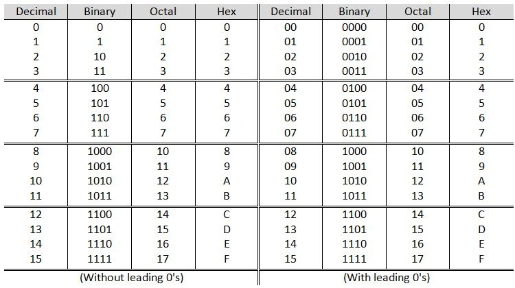

# convert_numbers
This is code to convert number from any famous numbrieng system to any famous numbrieng system
... I main (Decimal - binary - Octal - Hexadecimal)
------------------------------------------
I hope you understood algorithm in code :)
------------------------------------------
Thanks a lot
------------------------------------------

